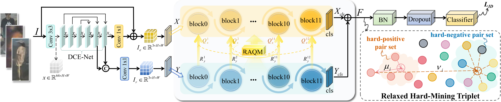
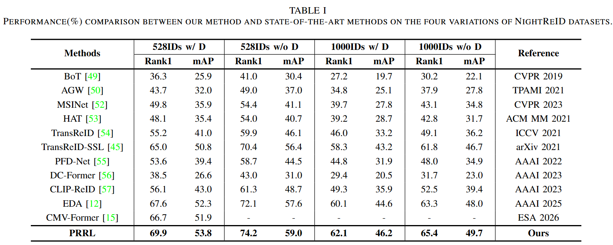
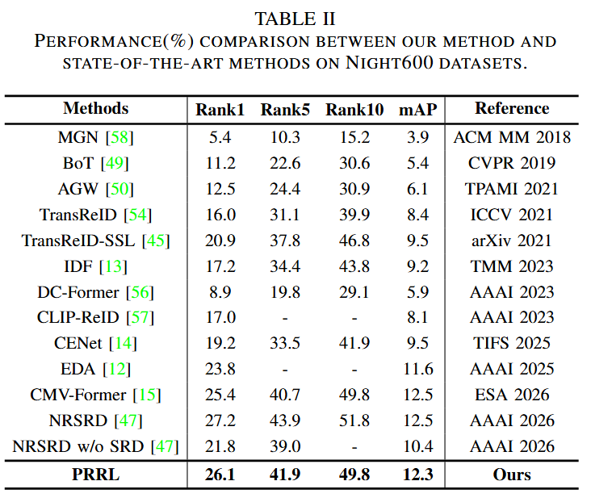
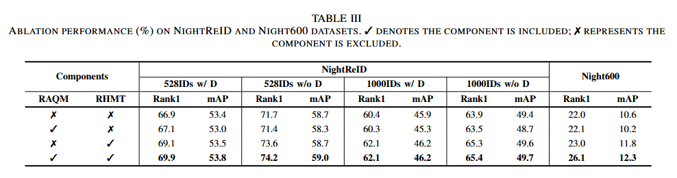

# Progressive Relighting Representation Learning for RGB-based Low-light Person Re-identification

[](./LICENSE)
[](https://pytorch.org/)

Official PyTorch implementation of the paper **Progressive Relighting Representation Learning for RGB-based Low-light Person Re-identification**.

## Updates

- (01/10/2026) Code released!

## Highlights

In this paper, we propose a **progressive relighting representation learning (PRRL)** framework to investigate this direction. PRRL establishes dense interactions between relighting and identity encoding along the network depth, allowing relighting information to participate continuously in the formation of identity representations. These interactions are implemented through a **relighting-aware query modulation (RAQM)** module embedded in each self-attention layer of the ReID encoder. At each layer, RAQM extracts relighting cues from an enhancement branch and adaptively modulates the query embeddings before attention computation. Since query embeddings directly influence which contextual information each identity token attends to, their modulation allows the attention patterns to adapt to relighting guidance during successive encoding stages, thereby steering intermediate identity representations as they evolve through the encoder. For training stability under noisy nighttime observations, we incorporate a relaxed hard-mining triplet (RHMT) for learning.



## Usage

### Requirements

We use a single NVIDIA RTX 3090 24G GPU for training and evaluation. 

```
pytorch 1.8.2
torchvision 0.9.2
yacs
timm
scipy
scikit-image
tqdm
```

You can install all dependencies via:
```
pip install -r requirements.txt
```


### Prepare Datasets

Download the datasets from their original providers:

- [NightReID](https://github.com/msm8976/NightReID)
- [Night600](https://github.com/Alexadlu/IDF)

Please follow the original dataset access requirements and usage terms.

Organize the datasets as follows:

```
your dataset root dir/
├── NightReID/
│   ├── bounding_box_train/
│   ├── query/
│   ├── query-1000/
│   ├── bounding_box_test/
│   ├── bounding_box_test-528-noDistractors/
│   ├── bounding_box_test_withDistractors/
│   └── bounding_box_test-1000-noDistractors/
└── night600/
    ├── bounding_box_train/
    ├── query_3/
    └── bounding_box_test/
```

Set `DATASETS.ROOT_DIR` and `DATASETS.NAMES` in the config file (e.g. `configs/nightreid/PRR.yml`) accordingly. `DATASETS.EVAL_MODE` selects the NightReID evaluation protocol (`528_wD` / `528_woD` / `1000_wD` / `1000_woD`).


### Training

Download the **ViT-B/16+ICS** pre-trained backbone from [TransReID-SSL](https://github.com/damo-cv/TransReID-SSL#pre-trained-models), and set `MODEL.PRETRAIN_PATH` to the downloaded `vit_base_ics_cfs_lup.pth` file.

The default YAML configurations correspond to the full PRRL model. For ablation studies and parameter analysis, modify the relevant parameters to match the checkpoint being evaluated.

```bash
# NightReID
python train.py --config_file configs/nightreid/PRR.yml 

# Night600
python train.py --config_file configs/night600/PRR.yml
```


### Testing

After training, evaluate the saved checkpoint using the same model configuration.

```bash
# NightReID
python test.py --config_file configs/nightreid/PRR.yml 

# Night600
python test.py --config_file configs/night600/PRR.yml
```

For NightReID, change `DATASETS.EVAL_MODE` to select the evaluation protocol:

| `DATASETS.EVAL_MODE` | Evaluation protocol |
| --- | --- |
| `528_wD` | 528 identities with distractors |
| `528_woD` | 528 identities without distractors |
| `1000_wD` | 1000 identities with distractors |
| `1000_woD` | 1000 identities without distractors |


## Comparison with State-of-the-Art Methods

The following results (%) are reported in our paper.

<p align="center">
  
</p>
<p align="center">
  
</p>


## Reproducing the Paper Results

### Download Trained Checkpoints

To reproduce the reported results without retraining, download the corresponding trained checkpoints: [Baidu Netdisk](https://pan.baidu.com/s/1KYLy3Es6vteR0VAYuY8njg?pwd=646i)

The download is organized into the following experiment folders. Place them under `./logs/` and preserve their original names:

```text
logs/
├── baseline_night600/
├── baseline_nightreid/
├── relighting interval/
│   ├── night600/
│   │   ├── pos3_neg7_Frequency1_Tri1.0_LossType_prr_triplet/
│   │   ├── pos3_neg7_Frequency3_Tri1.0_LossType_prr_triplet/
│   │   └── pos3_neg7_Frequency6_Tri1.0_LossType_prr_triplet/
│   └── nightreid/
└── s_pos_s_neg/
```

The `baseline_*` folders contain baseline/ablation experiment files. The `relighting interval` and `s_pos_s_neg` folders organize the corresponding parameter experiments.

### Evaluate the Full Model

The trained models are stored at:

- **NightReID:** `./logs/s_pos_s_neg/nightreid/pos3_neg1_Frequency1_Tri1.0_LossType_prr_triplet/transformer_best_mAP.pth`
- **Night600:** `./logs/s_pos_s_neg/night600/pos3_neg7_Frequency1_Tri1.0_LossType_prr_triplet/transformer_best_mAP.pth`

```bash
# NightReID
python test.py --config_file configs/nightreid/PRR.yml \
  TEST.WEIGHT "./logs/s_pos_s_neg/nightreid/pos3_neg1_Frequency1_Tri1.0_LossType_prr_triplet/transformer_best_mAP.pth"

# Night600
python test.py --config_file configs/night600/PRR.yml \
  TEST.WEIGHT "./logs/s_pos_s_neg/night600/pos3_neg7_Frequency1_Tri1.0_LossType_prr_triplet/transformer_best_mAP.pth"
```

The default evaluation protocol is `528_wD`. To evaluate other protocols, change `DATASETS.EVAL_MODE` in `configs/nightreid/PRR.yml` to `528_woD`, `1000_wD`, or `1000_woD`.


## Ablation Studies

We investigate the contributions of RAQM and RHMT.

<p align="center">
  
</p>

The default YAML configurations are used unless stated otherwise. They correspond to the full PRRL model:

- `MODEL.INTERACTION_INTERVAL=1`
- NightReID: `K_pos=3`, `K_neg=1`
- Night600: `K_pos=3`, `K_neg=7`

Before evaluation, configure the dataset path, pretrained backbone path, and GPU ID in the corresponding YAML file. For NightReID, change `DATASETS.EVAL_MODE` to evaluate different protocols.

Removing RHMT refers to training with single hard-positive and hard-negative mining: `K_pos=1` and `K_neg=1`.

```bash
# Row 1: Baseline without PRRL
# NightReID
python test_woRAQM.py --config_file configs/nightreid/PRR.yml SOLVER.HARD_EXAMPLE_POS_K 1 SOLVER.HARD_EXAMPLE_NEG_K 1 TEST.WEIGHT "./logs/baseline_nightreid/pos1_neg1/transformer_best_mAP.pth"

# Night600
python test_woRAQM.py --config_file configs/night600/PRR.yml SOLVER.HARD_EXAMPLE_POS_K 1 SOLVER.HARD_EXAMPLE_NEG_K 1 TEST.WEIGHT "./logs/baseline_night600/pos1_neg1/transformer_best_mAP.pth"

# Row 2: RAQM Only
# NightReID
python test.py --config_file configs/nightreid/PRR.yml SOLVER.HARD_EXAMPLE_POS_K 1 SOLVER.HARD_EXAMPLE_NEG_K 1 TEST.WEIGHT "./logs/s_pos_s_neg/nightreid/pos1_neg1_Frequency1_Tri1.0_LossType_prr_triplet/transformer_best_mAP.pth"

# Night600
python test.py --config_file configs/night600/PRR.yml SOLVER.HARD_EXAMPLE_POS_K 1 SOLVER.HARD_EXAMPLE_NEG_K 1 TEST.WEIGHT "./logs/s_pos_s_neg/night600/pos1_neg1_Frequency1_Tri1.0_LossType_prr_triplet/transformer_best_mAP.pth"

# Row 3: RHMT Only
# NightReID
python test_woRAQM.py --config_file configs/nightreid/PRR.yml TEST.WEIGHT "./logs/baseline_nightreid/pos3_neg1/transformer_best_mAP.pth"

# Night600
python test_woRAQM.py --config_file configs/night600/PRR.yml TEST.WEIGHT "./logs/baseline_night600/pos3_neg7/transformer_best_mAP.pth"

# Row 4: Full PRRL
# NightReID
python test.py --config_file configs/nightreid/PRR.yml TEST.WEIGHT "./logs/s_pos_s_neg/nightreid/pos3_neg1_Frequency1_Tri1.0_LossType_prr_triplet/transformer_best_mAP.pth"

# Night600
python test.py --config_file configs/night600/PRR.yml TEST.WEIGHT "./logs/s_pos_s_neg/night600/pos3_neg7_Frequency1_Tri1.0_LossType_prr_triplet/transformer_best_mAP.pth"
```

## Parameter Analysis

Set the following parameters in the corresponding YAML file before evaluation:

| Parameter | Configuration key |
| --- | --- |
| Relighting interval `s` | `MODEL.INTERACTION_INTERVAL` |
| Positive mining count `K_pos` | `SOLVER.HARD_EXAMPLE_POS_K` |
| Negative mining count `K_neg` | `SOLVER.HARD_EXAMPLE_NEG_K` |

The testing script automatically loads the checkpoint using the configured parameters:

```text
{OUTPUT_DIR}/pos{K_pos}_neg{K_neg}_Frequency{s}_Tri1.0_LossType_prr_triplet/transformer_best_mAP.pth
```

### Relighting Interval

Set `MODEL.INTERACTION_INTERVAL` to `1`, `3`, or `6`.

```bash
# NightReID
python test.py --config_file configs/nightreid/PRR.yml \
  OUTPUT_DIR "./logs/relighting interval/nightreid"

# Night600
python test.py --config_file configs/night600/PRR.yml \
  OUTPUT_DIR "./logs/relighting interval/night600"
```

### Positive and Negative Mining

Keep `MODEL.INTERACTION_INTERVAL=1`.
Use the following commands for either analysis after updating the corresponding YAML parameters.

```bash
# NightReID
python test.py --config_file configs/nightreid/PRR.yml \
  OUTPUT_DIR "./logs/s_pos_s_neg/nightreid"

# Night600
python test.py --config_file configs/night600/PRR.yml \
  OUTPUT_DIR "./logs/s_pos_s_neg/night600"
```

## Acknowledgments

We thank the authors of [NightReID / EDA](https://github.com/msm8976/NightReID), [Night600 / IDF](https://github.com/Alexadlu/IDF), [TransReID-SSL](https://github.com/damo-cv/TransReID-SSL), and [Zero-DCE](https://github.com/Li-Chongyi/Zero-DCE) for sharing their code, datasets, and pretrained models.
